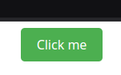
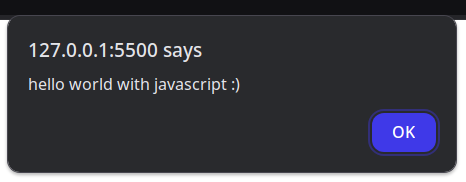
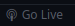
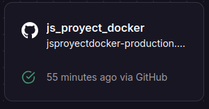
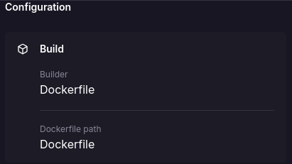
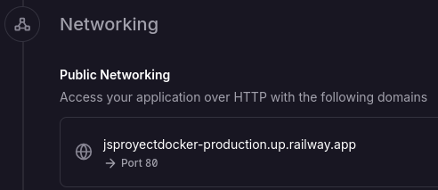

# Hello world whit javascript
## Results
<p align="center">
    
</p>
<p align="center">
    
</p>

It is a program that manipulates the DOM and presents a typical hello world message

## :open_book: How to use
### Pre-requisites
* Web browser
* VSCode editor
* VSCode Live Server extension
---
* Clone the repository

    ```
    git clone https://github.com/Pablo-man/js_proyect_docker.git
    ```
> [!NOTE]
> Because the application is made up of statistical files, these must be served on a web server, so the VSCode code editor will be used together with the live server extension in this example.

* Once the project has been cloned, you must open it with the VSCode code editor with the Live Server extension previously installed

* Inside the editor, open the index.html file and press the button corresponding to the mentioned extension, which is located in the lower right area of ​​the editor window

    

## :rocket: How to run with docker
### Pre-requisites
* Docker - DockerDesktop installed
* DockerHub account
---
Visit the following link to learn about the process of generating the project image and contenerization

:whale2: [GO](https://hub.docker.com/repository/docker/pamendeza/js_docker_project, "Docker steps")

## :light_rail: PAAS Deploy(Railway)
For its deployment in a PAAS we will rely on railway and its easy implementation thanks to its container management. 



The platform automatically uses our Dockerfile to build the container. 



> [!IMPORTANT]
> Next, the configuration that we must add is the generation of a domain along with the desired port, in this case the indicated thing would be to point to port 80 on which nginx is working



[Hello World](https://jsproyectdocker-production.up.railway.app "click for visit")